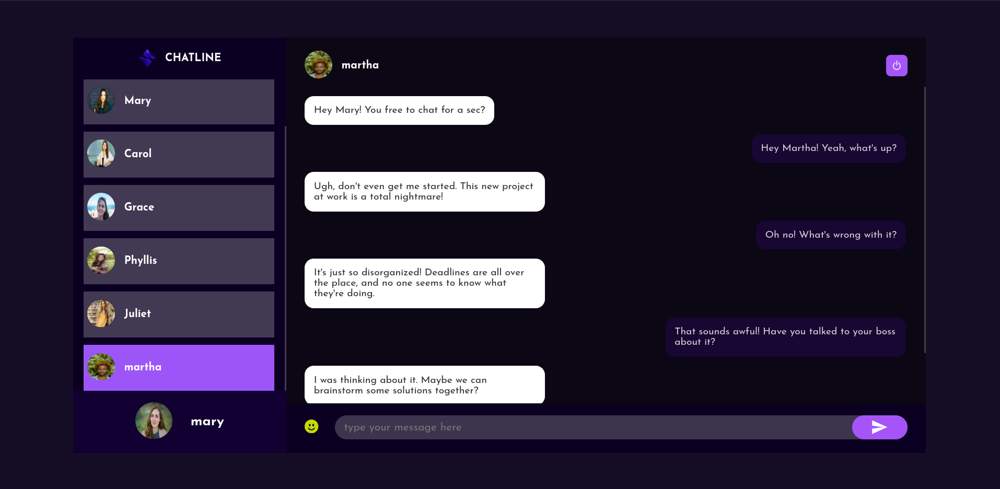

### A real time chat application made with Nodejs (backend), React(frontend) and MongoDB(database)

=> View screenshots below

 

 

 

 

#### How to run the project

=> Download the source code
=> navigate to the server folder and create a .env file
=> add a PORT and MONGO_URL values to the env file, e.g `PORT=5000`, `MONGO_URL="mongodb://localhost:27017/chatline"` these values may be different, for example if using altas mongodb, your MONGO_URL is going to be the connection string you get from mongo atlas
=> Now cd into the server durectory and run `npm install`
=> Next cd into client directory and run `npm install`
=> to run the server(backend) type, `npm start` and to run the client(frontend) type `npm run dev`
